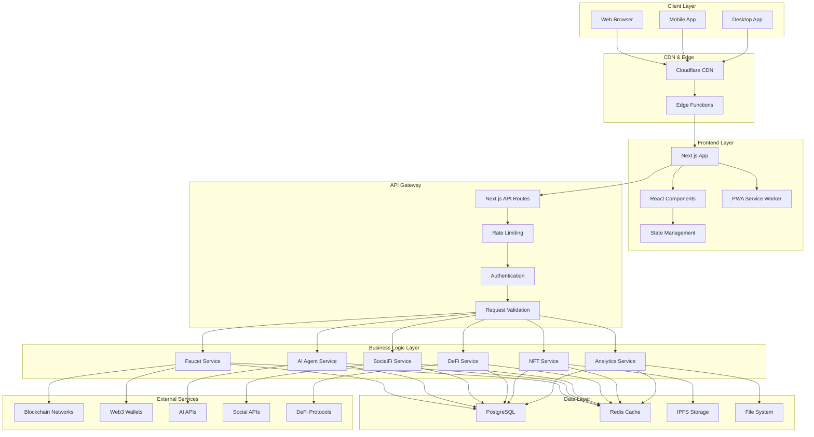

# 🏗️ Arquitetura do FaucetChain

## Visão Geral da Arquitetura

O FaucetChain é construído seguindo os princípios de **arquitetura modular**, **escalabilidade horizontal** e **separação de responsabilidades**. A aplicação utiliza uma arquitetura híbrida que combina elementos de **monolito modular** com **microserviços** para diferentes domínios.

## Diagrama de Arquitetura



## Camadas da Aplicação

### 1. Client Layer (Camada do Cliente)

**Responsabilidades:**

- Interface do usuário
- Interação com Web3
- Cache local
- Sincronização offline

**Tecnologias:**

- Next.js 15.2.4 (App Router)
- React 18.3.1
- TypeScript 5.0
- Tailwind CSS 3.4.17
- PWA capabilities

### 2. CDN & Edge Layer

**Responsabilidades:**

- Distribuição global de conteúdo
- Cache de assets estáticos
- Edge computing para funções leves
- DDoS protection

**Tecnologias:**

- Cloudflare CDN
- Edge Functions
- Image optimization
- Static asset delivery

### 3. Frontend Layer

**Responsabilidades:**

- Renderização de componentes
- Gerenciamento de estado
- Roteamento client-side
- Interação com APIs

**Arquitetura:**

```
Frontend Layer/
├── App Router (Next.js 13+)
│   ├── Layouts
│   ├── Pages
│   └── Loading/Error boundaries
├── Component Architecture
│   ├── UI Components (shadcn/ui)
│   ├── Business Components
│   └── Layout Components
├── State Management
│   ├── React Context
│   ├── Local Storage
│   └── URL State
└── Service Layer
    ├── API Clients
    ├── Web3 Integration
    └── Cache Management
```

### 4. API Gateway Layer

**Responsabilidades:**

- Roteamento de requisições
- Autenticação e autorização
- Rate limiting
- Validação de dados
- Logging e monitoramento

**Estrutura:**

```
API Gateway/
├── Middleware
│   ├── Authentication
│   ├── Rate Limiting
│   ├── CORS
│   └── Request Logging
├── Route Handlers
│   ├── /api/auth/*
│   ├── /api/faucet/*
│   ├── /api/ai/*
│   ├── /api/social/*
│   └── /api/defi/*
└── Error Handling
    ├── Global Error Handler
    ├── Validation Errors
    └── Custom Error Types
```

### 5. Business Logic Layer

**Responsabilidades:**

- Lógica de negócio específica
- Processamento de dados
- Integração com serviços externos
- Orquestração de operações complexas

**Serviços:**

#### Faucet Service

```typescript
class FaucetService {
  async claimTokens(faucetId: string, userId: string): Promise<ClaimResult>;
  async getAvailableFaucets(userId: string): Promise<Faucet[]>;
  async checkCooldown(
    faucetId: string,
    userId: string
  ): Promise<CooldownStatus>;
  async validateRequirements(
    faucetId: string,
    userId: string
  ): Promise<boolean>;
}
```

#### AI Agent Service

```typescript
class AIAgentService {
  async processUserMessage(
    message: string,
    context: UserContext
  ): Promise<AIResponse>;
  async generateRecommendations(userId: string): Promise<Recommendation[]>;
  async analyzeNetworkMetrics(): Promise<NetworkAnalysis>;
  async executeOptimization(action: OptimizationAction): Promise<ActionResult>;
}
```

#### SocialFi Service

```typescript
class SocialFiService {
  async createPost(userId: string, content: string): Promise<Post>;
  async likePost(postId: string, userId: string): Promise<LikeResult>;
  async calculateRewards(userId: string): Promise<RewardCalculation>;
  async updateLeaderboard(): Promise<LeaderboardEntry[]>;
}
```

### 6. Data Layer

**Responsabilidades:**

- Persistência de dados
- Cache de alta performance
- Armazenamento de arquivos
- Backup e recovery

**Estrutura:**

#### PostgreSQL (Primary Database)

```sql
-- Schema principal
CREATE SCHEMA faucetchain;

-- Tabelas principais
CREATE TABLE users (
  id UUID PRIMARY KEY DEFAULT gen_random_uuid(),
  wallet_address VARCHAR(42) UNIQUE NOT NULL,
  username VARCHAR(50) UNIQUE,
  faucet_score INTEGER DEFAULT 0,
  drip_balance DECIMAL(18,8) DEFAULT 0,
  created_at TIMESTAMP DEFAULT NOW(),
  updated_at TIMESTAMP DEFAULT NOW()
);

CREATE TABLE faucets (
  id UUID PRIMARY KEY DEFAULT gen_random_uuid(),
  name VARCHAR(100) NOT NULL,
  token VARCHAR(20) NOT NULL,
  amount DECIMAL(18,8) NOT NULL,
  cooldown_seconds INTEGER NOT NULL,
  requirements JSONB,
  type VARCHAR(20) NOT NULL,
  is_active BOOLEAN DEFAULT true
);

CREATE TABLE claims (
  id UUID PRIMARY KEY DEFAULT gen_random_uuid(),
  user_id UUID REFERENCES users(id),
  faucet_id UUID REFERENCES faucets(id),
  amount DECIMAL(18,8) NOT NULL,
  transaction_hash VARCHAR(66),
  claimed_at TIMESTAMP DEFAULT NOW()
);
```

#### Redis (Cache Layer)

```typescript
// Estrutura de cache
interface CacheStructure {
  // User sessions
  "session:user:${userId}": UserSession;

  // Faucet cooldowns
  "cooldown:${userId}:${faucetId}": number;

  // Leaderboard cache
  "leaderboard:global": LeaderboardEntry[];
  "leaderboard:weekly": LeaderboardEntry[];

  // AI analysis cache
  "ai:analysis:${date}": NetworkAnalysis;

  // Rate limiting
  "rate_limit:${ip}:${endpoint}": number;
}
```

## Padrões de Design

### 1. Repository Pattern

```typescript
interface UserRepository {
  findById(id: string): Promise<User | null>;
  findByWalletAddress(address: string): Promise<User | null>;
  create(user: CreateUserData): Promise<User>;
  update(id: string, data: UpdateUserData): Promise<User>;
  delete(id: string): Promise<void>;
}

class PostgreSQLUserRepository implements UserRepository {
  constructor(private db: Database) {}

  async findById(id: string): Promise<User | null> {
    const result = await this.db.query("SELECT * FROM users WHERE id = $1", [
      id,
    ]);
    return result.rows[0] || null;
  }

  // ... outros métodos
}
```

### 2. Service Layer Pattern

```typescript
class UserService {
  constructor(
    private userRepo: UserRepository,
    private cacheService: CacheService,
    private blockchainService: BlockchainService
  ) {}

  async getUserProfile(userId: string): Promise<UserProfile> {
    // Verificar cache primeiro
    const cached = await this.cacheService.get(`user:${userId}`);
    if (cached) return cached;

    // Buscar no banco
    const user = await this.userRepo.findById(userId);
    if (!user) throw new UserNotFoundError();

    // Buscar dados da blockchain
    const balance = await this.blockchainService.getBalance(user.walletAddress);

    const profile: UserProfile = {
      ...user,
      balance,
    };

    // Cachear resultado
    await this.cacheService.set(`user:${userId}`, profile, 300);

    return profile;
  }
}
```

### 3. Event-Driven Architecture

```typescript
// Event Bus
class EventBus {
  private listeners: Map<string, Function[]> = new Map();

  on(event: string, listener: Function): void {
    if (!this.listeners.has(event)) {
      this.listeners.set(event, []);
    }
    this.listeners.get(event)!.push(listener);
  }

  emit(event: string, data: any): void {
    const eventListeners = this.listeners.get(event) || [];
    eventListeners.forEach((listener) => listener(data));
  }
}

// Eventos do sistema
interface SystemEvents {
  "user.registered": { userId: string; walletAddress: string };
  "faucet.claimed": { userId: string; faucetId: string; amount: number };
  "post.created": { userId: string; postId: string; content: string };
  "ai.action.approved": { actionId: string; userId: string };
}

// Uso em serviços
class FaucetService {
  constructor(private eventBus: EventBus) {}

  async claimFaucet(userId: string, faucetId: string): Promise<void> {
    // Lógica de claim
    const result = await this.processClaim(userId, faucetId);

    // Emitir evento
    this.eventBus.emit("faucet.claimed", {
      userId,
      faucetId,
      amount: result.amount,
    });
  }
}
```

## Segurança

### 1. Autenticação e Autorização

```typescript
// JWT Strategy
interface JWTPayload {
  userId: string;
  walletAddress: string;
  iat: number;
  exp: number;
}

// Middleware de autenticação
export function withAuth(handler: NextApiHandler): NextApiHandler {
  return async (req, res) => {
    const token = req.headers.authorization?.replace("Bearer ", "");

    if (!token) {
      return res.status(401).json({ error: "Token required" });
    }

    try {
      const payload = jwt.verify(token, process.env.JWT_SECRET!) as JWTPayload;
      req.user = payload;
      return handler(req, res);
    } catch (error) {
      return res.status(401).json({ error: "Invalid token" });
    }
  };
}
```

### 2. Rate Limiting

```typescript
// Rate limiting por IP e endpoint
const rateLimitMap = new Map<string, { count: number; resetTime: number }>();

export function rateLimit(maxRequests: number, windowMs: number) {
  return (req: NextApiRequest, res: NextApiResponse, next: Function) => {
    const key = `${req.socket.remoteAddress}:${req.url}`;
    const now = Date.now();
    const windowStart = now - windowMs;

    const current = rateLimitMap.get(key);

    if (!current || current.resetTime < windowStart) {
      rateLimitMap.set(key, { count: 1, resetTime: now });
      return next();
    }

    if (current.count >= maxRequests) {
      return res.status(429).json({ error: "Rate limit exceeded" });
    }

    current.count++;
    next();
  };
}
```

### 3. Validação de Dados

```typescript
// Schemas de validação com Zod
const claimFaucetSchema = z.object({
  faucetId: z.string().uuid(),
  signature: z.string().min(1),
  timestamp: z.number().positive(),
});

const createPostSchema = z.object({
  content: z.string().min(1).max(500),
  hashtags: z.array(z.string()).optional(),
});

// Middleware de validação
export function validateBody(schema: z.ZodSchema) {
  return (req: NextApiRequest, res: NextApiResponse, next: Function) => {
    try {
      req.body = schema.parse(req.body);
      next();
    } catch (error) {
      return res.status(400).json({
        error: "Validation failed",
        details: error.errors,
      });
    }
  };
}
```

## Performance e Escalabilidade

### 1. Caching Strategy

```typescript
// Multi-layer caching
class CacheService {
  constructor(
    private redis: Redis,
    private memoryCache: Map<string, any> = new Map()
  ) {}

  async get<T>(key: string): Promise<T | null> {
    // L1: Memory cache
    if (this.memoryCache.has(key)) {
      return this.memoryCache.get(key);
    }

    // L2: Redis cache
    const redisValue = await this.redis.get(key);
    if (redisValue) {
      const parsed = JSON.parse(redisValue);
      this.memoryCache.set(key, parsed);
      return parsed;
    }

    return null;
  }

  async set<T>(key: string, value: T, ttl: number = 300): Promise<void> {
    // Set in memory
    this.memoryCache.set(key, value);

    // Set in Redis
    await this.redis.setex(key, ttl, JSON.stringify(value));
  }
}
```

### 2. Database Optimization

```sql
-- Índices otimizados
CREATE INDEX CONCURRENTLY idx_users_wallet_address ON users(wallet_address);
CREATE INDEX CONCURRENTLY idx_claims_user_id ON claims(user_id);
CREATE INDEX CONCURRENTLY idx_claims_claimed_at ON claims(claimed_at);
CREATE INDEX CONCURRENTLY idx_posts_created_at ON posts(created_at DESC);

-- Particionamento por data
CREATE TABLE claims_2024_01 PARTITION OF claims
FOR VALUES FROM ('2024-01-01') TO ('2024-02-01');

-- Views materializadas para analytics
CREATE MATERIALIZED VIEW user_stats AS
SELECT
  u.id,
  u.username,
  COUNT(c.id) as total_claims,
  SUM(c.amount) as total_earned,
  MAX(c.claimed_at) as last_claim
FROM users u
LEFT JOIN claims c ON u.id = c.user_id
GROUP BY u.id, u.username;
```

### 3. Horizontal Scaling

```typescript
// Load balancing configuration
const loadBalancerConfig = {
  strategy: "round-robin",
  healthCheck: {
    endpoint: "/health",
    interval: 30000,
    timeout: 5000,
  },
  instances: [
    { host: "app1.faucetchain.com", port: 3000 },
    { host: "app2.faucetchain.com", port: 3000 },
    { host: "app3.faucetchain.com", port: 3000 },
  ],
};

// Database connection pooling
const dbConfig = {
  host: process.env.DB_HOST,
  port: parseInt(process.env.DB_PORT!),
  database: process.env.DB_NAME,
  user: process.env.DB_USER,
  password: process.env.DB_PASSWORD,
  max: 20, // Maximum number of clients in the pool
  idleTimeoutMillis: 30000,
  connectionTimeoutMillis: 2000,
};
```

## Monitoramento e Observabilidade

### 1. Logging Strategy

```typescript
// Structured logging
interface LogEntry {
  timestamp: string;
  level: "info" | "warn" | "error" | "debug";
  service: string;
  message: string;
  metadata?: Record<string, any>;
  traceId?: string;
}

class Logger {
  private service: string;

  constructor(service: string) {
    this.service = service;
  }

  info(message: string, metadata?: Record<string, any>): void {
    this.log("info", message, metadata);
  }

  error(message: string, error?: Error, metadata?: Record<string, any>): void {
    this.log("error", message, { ...metadata, error: error?.stack });
  }

  private log(
    level: string,
    message: string,
    metadata?: Record<string, any>
  ): void {
    const entry: LogEntry = {
      timestamp: new Date().toISOString(),
      level: level as any,
      service: this.service,
      message,
      metadata,
      traceId: this.getTraceId(),
    };

    console.log(JSON.stringify(entry));
  }
}
```

### 2. Metrics Collection

```typescript
// Custom metrics
class MetricsCollector {
  private metrics: Map<string, number> = new Map();

  incrementCounter(name: string, value: number = 1): void {
    const current = this.metrics.get(name) || 0;
    this.metrics.set(name, current + value);
  }

  setGauge(name: string, value: number): void {
    this.metrics.set(name, value);
  }

  recordHistogram(name: string, value: number): void {
    // Implementation for histogram recording
  }

  getMetrics(): Record<string, number> {
    return Object.fromEntries(this.metrics);
  }
}

// Usage in services
class FaucetService {
  constructor(private metrics: MetricsCollector) {}

  async claimFaucet(userId: string, faucetId: string): Promise<void> {
    const startTime = Date.now();

    try {
      await this.processClaim(userId, faucetId);
      this.metrics.incrementCounter("faucet.claims.success");
    } catch (error) {
      this.metrics.incrementCounter("faucet.claims.error");
      throw error;
    } finally {
      const duration = Date.now() - startTime;
      this.metrics.recordHistogram("faucet.claim.duration", duration);
    }
  }
}
```

## Deployment e DevOps

### 1. Container Strategy

```dockerfile
# Dockerfile
FROM node:18-alpine AS base

# Install dependencies only when needed
FROM base AS deps
RUN apk add --no-cache libc6-compat
WORKDIR /app

COPY package.json package-lock.json* ./
RUN npm ci

# Rebuild the source code only when needed
FROM base AS builder
WORKDIR /app
COPY --from=deps /app/node_modules ./node_modules
COPY . .

RUN npm run build

# Production image, copy all the files and run next
FROM base AS runner
WORKDIR /app

ENV NODE_ENV production

RUN addgroup --system --gid 1001 nodejs
RUN adduser --system --uid 1001 nextjs

COPY --from=builder /app/public ./public
COPY --from=builder --chown=nextjs:nodejs /app/.next/standalone ./
COPY --from=builder --chown=nextjs:nodejs /app/.next/static ./.next/static

USER nextjs

EXPOSE 3000

ENV PORT 3000

CMD ["node", "server.js"]
```

### 2. CI/CD Pipeline

```yaml
# .github/workflows/deploy.yml
name: Deploy to Production

on:
  push:
    branches: [main]

jobs:
  test:
    runs-on: ubuntu-latest
    steps:
      - uses: actions/checkout@v3
      - uses: actions/setup-node@v3
        with:
          node-version: "18"
          cache: "npm"

      - run: npm ci
      - run: npm run lint
      - run: npm run test
      - run: npm run build

  deploy:
    needs: test
    runs-on: ubuntu-latest
    steps:
      - uses: actions/checkout@v3

      - name: Deploy to Vercel
        uses: amondnet/vercel-action@v20
        with:
          vercel-token: ${{ secrets.VERCEL_TOKEN }}
          vercel-org-id: ${{ secrets.ORG_ID }}
          vercel-project-id: ${{ secrets.PROJECT_ID }}
          vercel-args: "--prod"
```

Esta arquitetura garante **escalabilidade**, **manutenibilidade** e **performance** para o FaucetChain, permitindo crescimento orgânico e adição de novas funcionalidades de forma estruturada.
