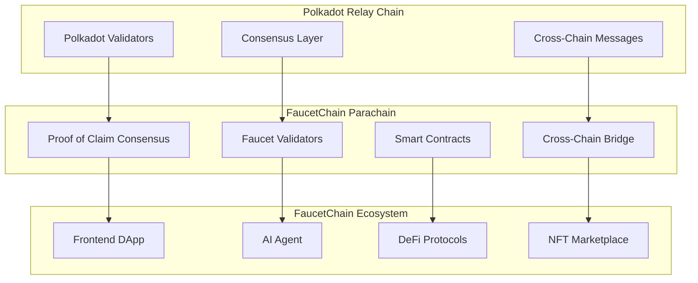

# 🌐 Integração FaucetChain com Polkadot

## Visão Geral

Este guia detalha como integrar a blockchain FaucetChain com consenso Proof of Claim (POC) na rede Polkadot como uma parachain.

## 🏗️ Arquitetura da Integração



## 📋 Pré-requisitos

### 1. Ferramentas Necessárias

```bash
# Instalar Rust
curl --proto '=https' --tlsv1.2 -sSf https://sh.rustup.rs | sh
source ~/.cargo/env

# Instalar Substrate
cargo install --git https://github.com/paritytech/substrate.git --tag v3.0.0 --force --locked substrate

# Instalar Polkadot
cargo install --git https://github.com/paritytech/polkadot.git --tag v0.9.0 --force --locked polkadot

# Instalar Node.js (para frontend)
curl -o- https://raw.githubusercontent.com/nvm-sh/nvm/v0.39.0/install.sh | bash
nvm install 18
nvm use 18
```

### 2. Dependências do Sistema

```bash
# Ubuntu/Debian
sudo apt update
sudo apt install -y git clang curl libssl-dev llvm libudev-dev

# macOS
brew install openssl cmake llvm
```

## 🚀 Estrutura do Projeto Substrate

### 1. Criar o Projeto Base

```bash
# Criar novo projeto Substrate
substrate-node-new faucetchain-node faucetchain-runtime

# Estrutura resultante
faucetchain-node/
├── Cargo.toml
├── runtime/
│   ├── Cargo.toml
│   └── src/
│       ├── lib.rs
│       ├── faucet.rs
│       ├── consensus.rs
│       └── bridge.rs
├── node/
│   ├── Cargo.toml
│   └── src/
│       └── service.rs
└── pallets/
    ├── faucet-pallet/
    ├── consensus-pallet/
    └── bridge-pallet/
```

### 2. Configuração do Runtime

```rust
// runtime/src/lib.rs
use sp_api::impl_runtime_apis;
use sp_runtime::{
    create_runtime_str, generic, impl_opaque_keys,
    traits::{BlakeTwo256, Block as BlockT, IdentifyAccount, Verify},
    transaction_validity::{TransactionSource, TransactionValidity},
    ApplyExtrinsicResult, MultiSignature,
};

pub use sp_consensus_aura::sr25519::AuthorityId as AuraId;
pub use sp_runtime::{MultiAddress, Perbill, Permill};

// FaucetChain specific types
pub type AccountId = <<Signature as Verify>::Signer as IdentifyAccount>::AccountId;
pub type BlockNumber = u32;
pub type Nonce = u32;
pub type Balance = u128;
pub type Hash = sp_core::H256;

// FaucetChain runtime
pub struct FaucetChainRuntime;

impl_runtime_apis! {
    impl sp_api::Core<Block> for FaucetChainRuntime {
        fn version() -> RuntimeVersion {
            VERSION
        }

        fn execute_block(block: Block) {
            Executive::execute_block(block);
        }
    }

    // Implementar outras APIs necessárias
}
```

## 🎯 Implementação do Consenso Proof of Claim

### 1. Pallet de Consenso

```rust
// pallets/consensus-pallet/src/lib.rs
#![cfg_attr(not(feature = "std"), no_std)]

use frame_support::{
    decl_module, decl_storage, decl_event, decl_error,
    traits::{Get, Randomness},
    weights::Weight,
};
use frame_system::ensure_signed;
use sp_std::vec::Vec;

pub trait Config: frame_system::Config {
    type Event: From<Event<Self>> + Into<<Self as frame_system::Config>::Event>;
    type Randomness: Randomness<Self::Hash, Self::BlockNumber>;
}

decl_storage! {
    trait Store for Module<T: Config> as ConsensusModule {
        // Validadores ativos
        pub Validators get(fn validators): Vec<T::AccountId>;

        // Claims pendentes
        pub PendingClaims get(fn pending_claims): map hasher(blake2_128_concat) T::AccountId => Vec<Claim>;

        // Histórico de claims
        pub ClaimHistory get(fn claim_history): map hasher(blake2_128_concat) T::AccountId => Vec<ClaimRecord>;

        // Configurações do consenso
        pub ConsensusConfig get(fn consensus_config): ConsensusConfig;
    }
}

decl_event! {
    pub enum Event<T> where AccountId = <T as frame_system::Config>::AccountId {
        ClaimSubmitted(AccountId, Claim),
        ClaimValidated(AccountId, Claim),
        ValidatorAdded(AccountId),
        ValidatorRemoved(AccountId),
    }
}

decl_error! {
    pub enum Error for Module<T: Config> {
        InvalidClaim,
        ClaimAlreadyExists,
        InsufficientStake,
        ValidatorNotAuthorized,
    }
}

decl_module! {
    pub struct Module<T: Config> for enum Call where origin: T::Origin {
        type Error = Error<T>;
        type Event = Event<T>;

        // Submeter claim para validação
        #[weight = 10_000]
        pub fn submit_claim(origin, claim: Claim) -> DispatchResult {
            let who = ensure_signed(origin)?;

            // Validar claim
            Self::validate_claim(&claim)?;

            // Adicionar aos claims pendentes
            <PendingClaims<T>>::mutate(&who, |claims| {
                claims.push(claim.clone());
            });

            Self::deposit_event(Event::ClaimSubmitted(who, claim));
            Ok(())
        }

        // Validar claim (apenas validadores)
        #[weight = 10_000]
        pub fn validate_claim(origin, validator: T::AccountId, claim: Claim) -> DispatchResult {
            let who = ensure_signed(origin)?;

            // Verificar se é um validador
            ensure!(Self::validators().contains(&who), Error::<T>::ValidatorNotAuthorized);

            // Processar validação
            Self::process_claim_validation(&validator, &claim)?;

            Self::deposit_event(Event::ClaimValidated(validator, claim));
            Ok(())
        }
    }
}

// Estruturas de dados
#[derive(Clone, Encode, Decode, PartialEq, RuntimeDebug)]
pub struct Claim {
    pub faucet_id: u32,
    pub amount: u128,
    pub timestamp: u64,
    pub signature: Vec<u8>,
    pub proof_of_work: Vec<u8>,
}

#[derive(Clone, Encode, Decode, PartialEq, RuntimeDebug)]
pub struct ClaimRecord {
    pub claim: Claim,
    pub validator: AccountId,
    pub validated_at: u64,
    pub block_number: u32,
}

#[derive(Clone, Encode, Decode, PartialEq, RuntimeDebug)]
pub struct ConsensusConfig {
    pub min_stake: u128,
    pub max_validators: u32,
    pub claim_timeout: u64,
    pub validation_threshold: u32,
}
```

### 2. Pallet de Faucet

```rust
// pallets/faucet-pallet/src/lib.rs
#![cfg_attr(not(feature = "std"), no_std)]

use frame_support::{
    decl_module, decl_storage, decl_event, decl_error,
    traits::{Get, Randomness},
    weights::Weight,
};
use frame_system::ensure_signed;

pub trait Config: frame_system::Config {
    type Event: From<Event<Self>> + Into<<Self as frame_system::Config>::Event>;
    type Currency: Currency<Self::AccountId>;
}

decl_storage! {
    trait Store for Module<T: Config> as FaucetModule {
        // Faucets disponíveis
        pub Faucets get(fn faucets): map hasher(blake2_128_concat) u32 => FaucetInfo;

        // Cooldowns dos usuários
        pub UserCooldowns get(fn user_cooldowns): map hasher(blake2_128_concat) T::AccountId => map hasher(blake2_128_concat) u32 => u64;

        // Saldos dos usuários
        pub UserBalances get(fn user_balances): map hasher(blake2_128_concat) T::AccountId => u128;

        // Configurações do faucet
        pub FaucetConfig get(fn faucet_config): FaucetConfig;
    }
}

decl_event! {
    pub enum Event<T> where AccountId = <T as frame_system::Config>::AccountId {
        FaucetClaimed(AccountId, u32, u128),
        FaucetCreated(u32, FaucetInfo),
        CooldownUpdated(AccountId, u32, u64),
    }
}

decl_error! {
    pub enum Error for Module<T: Config> {
        FaucetNotFound,
        InsufficientBalance,
        CooldownActive,
        InvalidAmount,
    }
}

decl_module! {
    pub struct Module<T: Config> for enum Call where origin: T::Origin {
        type Error = Error<T>;
        type Event = Event<T>;

        // Claim de faucet
        #[weight = 10_000]
        pub fn claim_faucet(origin, faucet_id: u32) -> DispatchResult {
            let who = ensure_signed(origin)?;

            // Verificar se faucet existe
            let faucet = Self::faucets(faucet_id).ok_or(Error::<T>::FaucetNotFound)?;

            // Verificar cooldown
            let cooldown = Self::user_cooldowns(&who, faucet_id);
            let current_time = Self::current_timestamp();

            ensure!(current_time >= cooldown, Error::<T>::CooldownActive);

            // Verificar saldo do faucet
            ensure!(faucet.balance >= faucet.amount, Error::<T>::InsufficientBalance);

            // Processar claim
            Self::process_claim(&who, faucet_id, faucet.amount)?;

            Self::deposit_event(Event::FaucetClaimed(who, faucet_id, faucet.amount));
            Ok(())
        }
    }
}

#[derive(Clone, Encode, Decode, PartialEq, RuntimeDebug)]
pub struct FaucetInfo {
    pub name: Vec<u8>,
    pub token: Vec<u8>,
    pub amount: u128,
    pub cooldown: u64,
    pub balance: u128,
    pub is_active: bool,
}

#[derive(Clone, Encode, Decode, PartialEq, RuntimeDebug)]
pub struct FaucetConfig {
    pub max_faucets: u32,
    pub default_cooldown: u64,
    pub min_claim_amount: u128,
    pub max_claim_amount: u128,
}
```

## 🌉 Bridge Cross-Chain

### 1. Pallet de Bridge

```rust
// pallets/bridge-pallet/src/lib.rs
#![cfg_attr(not(feature = "std"), no_std)]

use frame_support::{
    decl_module, decl_storage, decl_event, decl_error,
    traits::Get,
    weights::Weight,
};
use frame_system::ensure_signed;

pub trait Config: frame_system::Config {
    type Event: From<Event<Self>> + Into<<Self as frame_system::Config>::Event>;
}

decl_storage! {
    trait Store for Module<T: Config> as BridgeModule {
        // Mensagens cross-chain pendentes
        pub PendingMessages get(fn pending_messages): map hasher(blake2_128_concat) u32 => CrossChainMessage;

        // Contador de mensagens
        pub MessageCounter get(fn message_counter): u32;

        // Configurações do bridge
        pub BridgeConfig get(fn bridge_config): BridgeConfig;
    }
}

decl_event! {
    pub enum Event<T> where AccountId = <T as frame_system::Config>::AccountId {
        MessageSent(u32, CrossChainMessage),
        MessageReceived(u32, CrossChainMessage),
        BridgeConfigured(BridgeConfig),
    }
}

decl_error! {
    pub enum Error for Module<T: Config> {
        InvalidMessage,
        MessageNotFound,
        BridgeNotConfigured,
    }
}

decl_module! {
    pub struct Module<T: Config> for enum Call where origin: T::Origin {
        type Error = Error<T>;
        type Event = Event<T>;

        // Enviar mensagem cross-chain
        #[weight = 10_000]
        pub fn send_message(origin, target_chain: u32, message: Vec<u8>) -> DispatchResult {
            let who = ensure_signed(origin)?;

            let message_id = Self::message_counter() + 1;
            let cross_chain_message = CrossChainMessage {
                id: message_id,
                sender: who.clone(),
                target_chain,
                message,
                timestamp: Self::current_timestamp(),
            };

            <PendingMessages<T>>::insert(message_id, &cross_chain_message);
            <MessageCounter<T>>::put(message_id);

            Self::deposit_event(Event::MessageSent(message_id, cross_chain_message));
            Ok(())
        }
    }
}

#[derive(Clone, Encode, Decode, PartialEq, RuntimeDebug)]
pub struct CrossChainMessage {
    pub id: u32,
    pub sender: AccountId,
    pub target_chain: u32,
    pub message: Vec<u8>,
    pub timestamp: u64,
}

#[derive(Clone, Encode, Decode, PartialEq, RuntimeDebug)]
pub struct BridgeConfig {
    pub supported_chains: Vec<u32>,
    pub message_timeout: u64,
    pub max_message_size: u32,
}
```

## 🔧 Configuração do Node

### 1. Service Configuration

```rust
// node/src/service.rs
use faucetchain_runtime::{
    self, opaque::Block, AccountId, Balance, Index, Nonce, RuntimeApi,
};
use sc_client_api::BlockBackend;
use sc_consensus::{LongestChain, SelectChain};
use sp_consensus_aura::sr25519::AuthorityPair as AuraPair;
use sp_runtime::traits::Block as BlockT;

pub type FullClient = sc_service::TFullClient<Block, RuntimeApi, NativeElseWasmExecutor<LocalExecutor>>;
pub type FullBackend = sc_service::TFullBackend<Block>;
pub type FullSelectChain = LongestChain<FullBackend, Block>;

pub fn new_full(config: Configuration) -> Result<TaskManager, ServiceError> {
    let (client, backend, keystore_container, task_manager) =
        sc_service::new_full_parts::<Block, RuntimeApi, _>(
            &config,
            |config: &sc_service::Configuration| {
                Ok(sc_service::new_full_client::<Block, RuntimeApi, _>(
                    config,
                    |config, backend| {
                        let executor = NativeElseWasmExecutor::<LocalExecutor>::new(
                            config.wasm_method,
                            config.default_heap_pages,
                            config.max_runtime_instances,
                        );
                        Ok(FullClient::new_with_backend_and_executor(
                            backend,
                            executor,
                            config.chain_spec,
                            config.network.clone(),
                            config.transaction_pool.clone(),
                            config.keystore_container.clone(),
                            config.telemetry.clone(),
                        )?)
                    },
                )?)
            },
        )?;

    let select_chain = FullSelectChain::new(backend.clone());
    let transaction_pool = Arc::new(
        sc_transaction_pool::BasicPool::new_full(
            config.transaction_pool.clone(),
            config.role.is_authority().into(),
            config.prometheus_registry(),
            task_manager.spawn_handle(),
            client.clone(),
        ),
    );

    let (network, network_status_sinks, system_rpc_tx, network_starter) =
        sc_network::NetworkWorker::new_full(
            config.network.clone(),
            client.clone(),
            network_config,
            &config,
            task_manager.spawn_handle(),
            client.clone(),
        )?;

    // Configurar consensus
    let consensus = Consensus::new(
        client.clone(),
        select_chain,
        keystore_container.keystore(),
        transaction_pool.clone(),
        prometheus_registry.clone(),
        telemetry.clone(),
    );

    Ok(task_manager)
}
```

## 🚀 Deploy na Polkadot

### 1. Configuração do Parachain

```bash
# Criar arquivo de configuração do parachain
cat > parachain-config.json << EOF
{
  "id": 2000,
  "name": "FaucetChain",
  "description": "FaucetChain - Proof of Claim Consensus",
  "homepage": "https://faucetchain.com",
  "telemetry": [
    {
      "endpoint": "wss://telemetry.polkadot.io/submit/",
      "minimum_difficulty": 1
    }
  ],
  "properties": {
    "tokenDecimals": 18,
    "tokenSymbol": "FAUCET"
  },
  "consensus": {
    "type": "proof-of-claim",
    "validators": 100,
    "minStake": "1000000000000000000000"
  }
}
EOF
```

### 2. Build do Runtime

```bash
# Build do runtime
cargo build --release

# Gerar WASM do runtime
cargo run --release --bin faucetchain-node -- build-spec --chain=dev > faucetchain-dev.json

# Gerar spec para mainnet
cargo run --release --bin faucetchain-node -- build-spec --chain=mainnet > faucetchain-mainnet.json
```

### 3. Deploy no Testnet

```bash
# Conectar ao Rococo testnet
./target/release/faucetchain-node \
  --chain=rococo-local \
  --validator \
  --base-path=/tmp/faucetchain \
  --port=30333 \
  --rpc-port=9944 \
  --ws-port=9945 \
  --rpc-cors=all \
  --rpc-methods=Unsafe \
  --unsafe-rpc-external \
  --unsafe-ws-external
```

## 🧪 Testes e Validação

### 1. Testes Unitários

```rust
// pallets/consensus-pallet/src/tests.rs
#[cfg(test)]
mod tests {
    use super::*;
    use crate::mock::*;
    use frame_support::assert_ok;

    #[test]
    fn test_claim_submission() {
        new_test_ext().execute_with(|| {
            let claim = Claim {
                faucet_id: 1,
                amount: 100,
                timestamp: 1000,
                signature: vec![1, 2, 3],
                proof_of_work: vec![4, 5, 6],
            };

            assert_ok!(ConsensusModule::submit_claim(Origin::signed(1), claim.clone()));

            let pending_claims = ConsensusModule::pending_claims(1);
            assert_eq!(pending_claims.len(), 1);
            assert_eq!(pending_claims[0], claim);
        });
    }

    #[test]
    fn test_claim_validation() {
        new_test_ext().execute_with(|| {
            // Setup validator
            <Validators<Test>>::put(vec![1]);

            let claim = Claim {
                faucet_id: 1,
                amount: 100,
                timestamp: 1000,
                signature: vec![1, 2, 3],
                proof_of_work: vec![4, 5, 6],
            };

            assert_ok!(ConsensusModule::submit_claim(Origin::signed(2), claim.clone()));
            assert_ok!(ConsensusModule::validate_claim(Origin::signed(1), 2, claim));
        });
    }
}
```

### 2. Testes de Integração

```bash
# Executar testes
cargo test

# Testes específicos do consensus
cargo test consensus_pallet

# Testes de performance
cargo test --release -- --ignored
```

## 📊 Monitoramento e Analytics

### 1. Métricas do Consenso

```rust
// Implementar métricas
impl<T: Config> Module<T> {
    pub fn get_consensus_metrics() -> ConsensusMetrics {
        ConsensusMetrics {
            total_validators: Self::validators().len() as u32,
            pending_claims: Self::pending_claims_count(),
            validated_claims: Self::validated_claims_count(),
            average_validation_time: Self::average_validation_time(),
        }
    }
}

#[derive(Clone, Encode, Decode, PartialEq, RuntimeDebug)]
pub struct ConsensusMetrics {
    pub total_validators: u32,
    pub pending_claims: u32,
    pub validated_claims: u32,
    pub average_validation_time: u64,
}
```

### 2. Dashboard de Monitoramento

```typescript
// frontend/src/components/ConsensusDashboard.tsx
import React, { useState, useEffect } from "react";
import { Card, CardContent, CardHeader, CardTitle } from "@/components/ui/card";

interface ConsensusMetrics {
  totalValidators: number;
  pendingClaims: number;
  validatedClaims: number;
  averageValidationTime: number;
}

export function ConsensusDashboard() {
  const [metrics, setMetrics] = useState<ConsensusMetrics | null>(null);

  useEffect(() => {
    const fetchMetrics = async () => {
      try {
        const response = await fetch("/api/consensus/metrics");
        const data = await response.json();
        setMetrics(data);
      } catch (error) {
        console.error("Failed to fetch consensus metrics:", error);
      }
    };

    fetchMetrics();
    const interval = setInterval(fetchMetrics, 5000);
    return () => clearInterval(interval);
  }, []);

  if (!metrics) return <div>Loading...</div>;

  return (
    <div className="grid grid-cols-1 md:grid-cols-2 lg:grid-cols-4 gap-6">
      <Card>
        <CardHeader>
          <CardTitle>Validators</CardTitle>
        </CardHeader>
        <CardContent>
          <div className="text-2xl font-bold">{metrics.totalValidators}</div>
        </CardContent>
      </Card>

      <Card>
        <CardHeader>
          <CardTitle>Pending Claims</CardTitle>
        </CardHeader>
        <CardContent>
          <div className="text-2xl font-bold">{metrics.pendingClaims}</div>
        </CardContent>
      </Card>

      <Card>
        <CardHeader>
          <CardTitle>Validated Claims</CardTitle>
        </CardHeader>
        <CardContent>
          <div className="text-2xl font-bold">{metrics.validatedClaims}</div>
        </CardContent>
      </Card>

      <Card>
        <CardHeader>
          <CardTitle>Avg Validation Time</CardTitle>
        </CardHeader>
        <CardContent>
          <div className="text-2xl font-bold">
            {metrics.averageValidationTime}ms
          </div>
        </CardContent>
      </Card>
    </div>
  );
}
```

## 🔐 Segurança e Auditoria

### 1. Validação de Claims

```rust
impl<T: Config> Module<T> {
    fn validate_claim(claim: &Claim) -> Result<(), Error<T>> {
        // Verificar assinatura
        if !Self::verify_signature(claim) {
            return Err(Error::<T>::InvalidClaim);
        }

        // Verificar proof of work
        if !Self::verify_proof_of_work(claim) {
            return Err(Error::<T>::InvalidClaim);
        }

        // Verificar timestamp
        let current_time = Self::current_timestamp();
        if claim.timestamp > current_time || current_time - claim.timestamp > 300 {
            return Err(Error::<T>::InvalidClaim);
        }

        Ok(())
    }

    fn verify_signature(claim: &Claim) -> bool {
        // Implementar verificação de assinatura
        // Usar criptografia adequada (Ed25519, SR25519, etc.)
        true
    }

    fn verify_proof_of_work(claim: &Claim) -> bool {
        // Implementar verificação de proof of work
        // Verificar se o hash atende ao target de dificuldade
        true
    }
}
```

### 2. Slashing e Penalties

```rust
impl<T: Config> Module<T> {
    fn slash_validator(validator: &T::AccountId, reason: SlashReason) -> DispatchResult {
        // Implementar lógica de slashing
        // Penalizar validador por comportamento malicioso

        Self::deposit_event(Event::ValidatorSlashed(validator.clone(), reason));
        Ok(())
    }
}

#[derive(Clone, Encode, Decode, PartialEq, RuntimeDebug)]
pub enum SlashReason {
    InvalidValidation,
    DoubleSigning,
    Offline,
    MaliciousBehavior,
}
```

## 📈 Próximos Passos

### 1. Fase de Desenvolvimento

1. **Implementar Pallets**: Completar implementação dos pallets
2. **Testes**: Executar testes unitários e de integração
3. **Auditoria**: Realizar auditoria de segurança
4. **Deploy Testnet**: Deploy no Rococo testnet
5. **Validação**: Testar com usuários reais

### 2. Fase de Produção

1. **Parachain Auction**: Participar do leilão de parachain
2. **Mainnet Deploy**: Deploy na Polkadot mainnet
3. **Governance**: Implementar sistema de governança
4. **Ecosystem**: Integrar com outros protocolos

### 3. Recursos Adicionais

- **Documentação**: [Substrate Documentation](https://substrate.dev/docs/)
- **Tutorials**: [Substrate Tutorials](https://substrate.dev/tutorials/)
- **Examples**: [Substrate Examples](https://github.com/substrate-developer-hub/substrate-node-template)
- **Community**: [Substrate Community](https://substrate.dev/community/)

---

Este guia fornece uma base sólida para integrar sua blockchain FaucetChain com consenso Proof of Claim na rede Polkadot. A implementação pode ser adaptada conforme suas necessidades específicas e requisitos de negócio.
